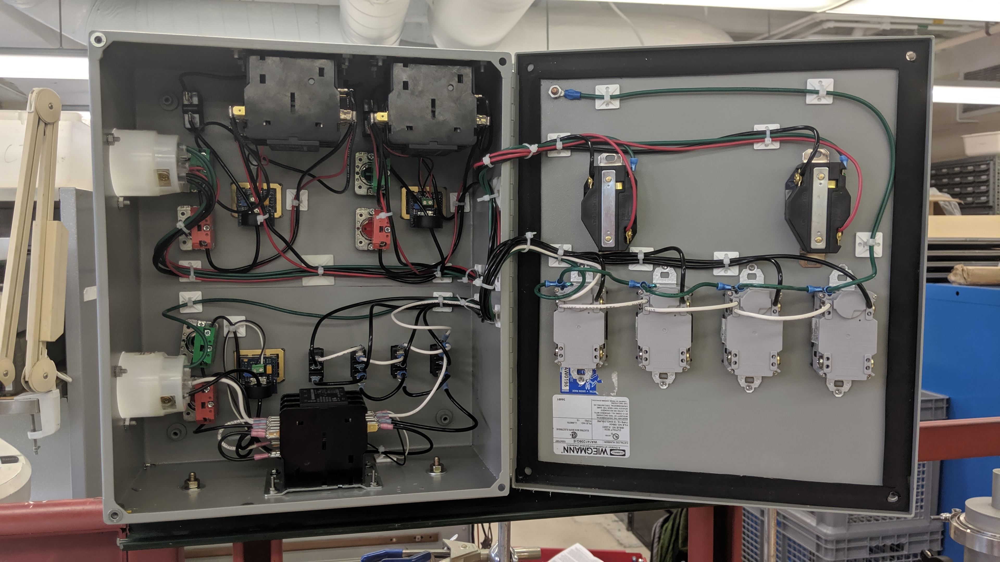

# power-distribution-box

Power distribution box made to use with the McMahon matrix isolation cart.

## Schematic

The schematic for this project was drawn using KiCad.
Please see `power-distribution.pdf`.

## Bill of Materials

| reference     | value           | manufacturer     | part number         | vendors |
| ------------- | --------------- | ---------------- | ------------------- | ------- |
|               | enclosure       | Hubbell-Wiegmann | WA141206GIE         | [AutomationDirect](https://www.automationdirect.com/adc/shopping/catalog/enclosures_-z-_subpanels_-z-_thermal_management_-z-_lighting/enclosures/wall-mount_enclosures/wa141206gie)
| CB1-CB4       | circuit breaker | TE               | W51-A122B1-5        | [DigiKey](https://www.digikey.com/en/products/detail/te-connectivity-potter-brumfield-relays/W51-A122B1-5/678285)| J1-J4      | 120 exit (GFCI) | Pass & Seymour   | 1597GRY             | [Crescent](https://www.cesco.com/Pass-Seymour-Inc-1597GRY-Pass-Seymour-1597-GRY-TradeMaster-reg-Self-Test-Duplex-GFCI-Receptacle-125-Volt-15-Amp-NEMA-5-15R-Specification-Grade-Gray/p1983117)
| P1            | 120 entry       | Leviton          | 2315                | [Crescent](https://www.cesco.com/Leviton-2315-Leviton-2315-V-0-MAX-trade-Grounding-Flanged-Inlet-Locking-Receptacle-20-Amp-125-Volt-2-Pole-3-Wire-NEMA-L5-20P-White/p2088539)
| P2            | 208 entry       | Leviton          | 2625F               | [Leviton](https://www.leviton.com/en/products/2625f)
| SW1, SW3, SW7 | "off" switch    | AutomationDirect | GCX1106             | [AutomationDirect](https://www.automationdirect.com/adc/shopping/catalog/pushbuttons_-z-_switches_-z-_indicators/22mm_metal/non-illuminated_pushbuttons_flush_-a-_extended/gcx1106)
| SW2, SW4, SW8 | "on" switch     | AutomationDirect | GCX1107             | [AutomationDirect](https://www.automationdirect.com/adc/shopping/catalog/pushbuttons_-z-_switches_-z-_indicators/22mm_metal/non-illuminated_pushbuttons_flush_-a-_extended/gcx1107)
| U1, U3, U6    | ammeter         | Murata           | ACA-20PC-4-AC1-RL-C | [Murata](https://www.murata.com/products/productdetail?partno=ACA-20PC-4-AC1-RL-C)
| U2            | 120 contactor   | Worldwide Elec.  | WDP40-3L-120        | [AutomationDirect](https://www.automationdirect.com/adc/shopping/catalog/motor_controls/definite_purpose_contactors/definite_purpose_contactors_(25_to_60_amp)/wdp40-3l-120)
